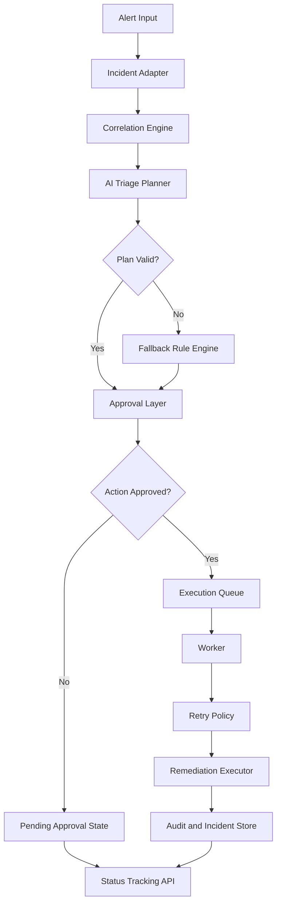

# AI Incident Triage Assistant

AI Incident Triage Assistant is a production-oriented backend system designed to ingest operational alerts, correlate related signals, assess incident severity, suggest likely root causes, recommend remediation steps, and orchestrate governed response workflows.

This project is designed to simulate how modern incident management platforms can combine AI-assisted reasoning with deterministic safeguards, approval-based actions, asynchronous execution, persistence, and deployment readiness.

## Why this project exists
Modern systems generate a large number of alerts, logs, and events, but incident response is still often noisy, manual, and slow. This project focuses on reducing that friction by turning raw alert signals into structured triage, probable cause insights, and response recommendations.

## Core capabilities
- Ingests structured incident alerts
- Normalizes incoming signals through an adapter layer
- Correlates alert context and prioritizes severity
- Uses AI-assisted triage with safe deterministic fallback logic
- Suggests likely root cause and recommended remediation
- Routes risky response actions through approval workflows
- Queues execution asynchronously for safer processing
- Applies retry logic for resilient task execution
- Tracks incident lifecycle through persistence and status APIs
- Supports containerized deployment with Docker

## Architecture Diagram



## End-to-end flow
Alert → Adapter → Correlation → AI Triage → Approval → Queue → Worker → Retry → Remediation → Audit → Status Tracking

## API endpoints
- `GET /health` — service health check
- `POST /triage-incident` — process incoming incident alerts
- `GET /status/{incident_id}` — fetch incident workflow status

## Example use cases
- Application latency spike incident triage
- Log-based anomaly grouping and severity classification
- Infrastructure alert response orchestration
- Human-in-the-loop remediation approval
- Root cause suggestion for repeated incidents

## Tech stack
- Python
- FastAPI
- Pydantic
- Docker

## Run locally
```bash
pip install -r requirements.txt
uvicorn app.main:app --reload
```

## Run with Docker
```bash
docker-compose up --build
```

Then open:
- `http://localhost:8000/docs`

## Why this is a strong engineering project
This project combines AI-oriented backend design, incident workflow orchestration, approval-based control, asynchronous processing, retry handling, persistence, and deployment readiness. It is intentionally built as a practical system design project rather than a one-off demo.

## Planned next steps
- Replace file-based persistence with PostgreSQL
- Add Redis or Kafka for production-grade queues
- Integrate vector search for similar incidents
- Add authentication and RBAC
- Add observability metrics and structured logging
