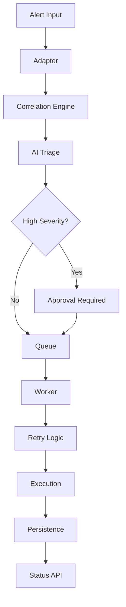

# AI Incident Triage Assistant

AI Incident Triage Assistant is a production-oriented backend system designed to ingest operational alerts, correlate signals, identify root causes, and orchestrate remediation workflows.

## 🔥 Architecture Diagram



## 🚀 Features
- AI-based incident triage (severity + root cause)
- Alert correlation engine
- Approval-based workflow for high-risk incidents
- Async execution using queue pattern
- Retry mechanism for resilience
- Persistence + status tracking
- Dockerized deployment

## 📡 APIs
- `POST /triage-incident`
- `GET /status/{correlation_id}`
- `GET /health`

## 🐳 Run with Docker
```bash
docker-compose up --build
```

Open:
http://localhost:8000/docs

## 🧪 Run locally
```bash
pip install -r requirements.txt
uvicorn app.main:app --reload
```

## 💡 Summary
This project demonstrates a real-world incident management pipeline combining AI reasoning, backend orchestration, async processing, and production readiness.
